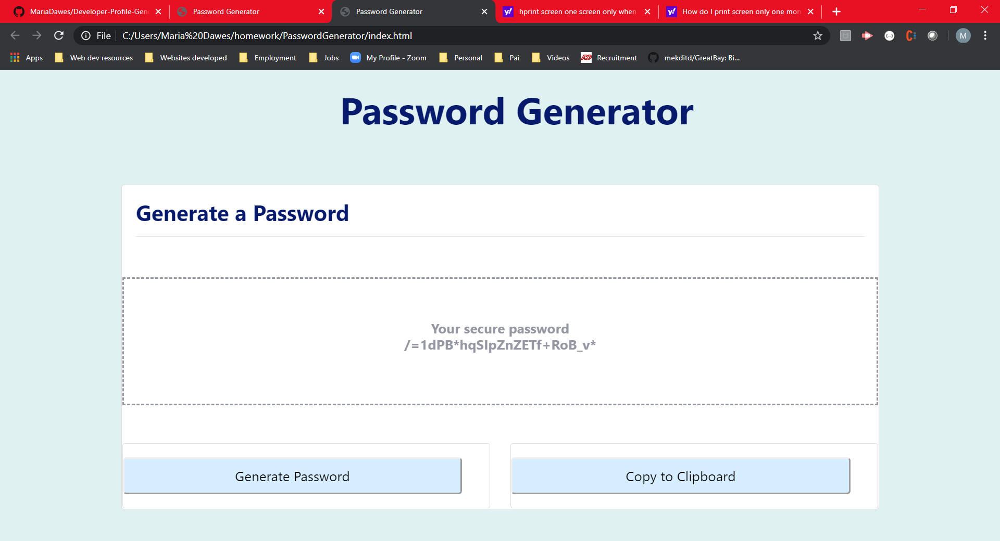

# PasswordGenerator
The project is to develop a password generator. The password lenght and character types are determined by the user. When the user presses the "Password Generator" button, the code generates and displays in a central box a random password, fitting the user's choices. 

## Motivation
This project is homework03 from UT Coding Bootcamp.

### Prerequisites
The software will run in any webpage

## Tests 
* Password length: The password lenght is determined by the user, from a pre-defined range of 8 to 128 characters. Any length chosen outside this range is not accepted, a warning message displayed and the input prompt for password length returns to the screen. 
* Character type choice: The user can choose the types of characters to be used in the generated password result - special chacters, numbers, lowercase, uppercase. The combination can range from one character type to all four. 
* Prompts and alerts: Verification that all input described above is correctly done via prompts and alerts.
* Button for password generation: There is a "generate password" button in the bottom of the page that when pressed displays the new generated password in a box in the center of the page.    

## Screenshots

## Author
Maria Dawes-Tedesco

## Built With
* HTML, CSS, JavaScript 

# Contributing
Please read [CONTRIBUTING.md](https://gist.github.com/PurpleBooth/b24679402957c63ec426) for details on our code of conduct, and the process for submitting pull requests to us.

## Versioning
For the versions available, see https://github.com/MariaDawes/PasswordGenerator/commits/master

## Acknowledgement
Thank you Kevin Geary and Luke Duquette for help with solving code bugs.